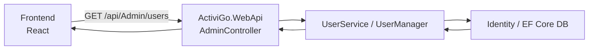
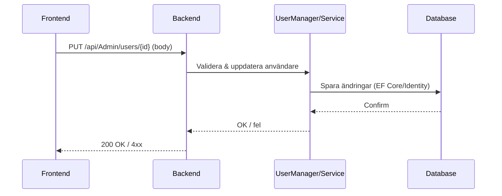

# ActiviGo — Backend

Kortfattat

- .NET Web API (ActiviGo.WebApi)
- Arkitektur: Controllers → Services → Repositories → EF Core → Databas
- Viktiga projektmappar:
  - ActiviGo.WebApi (API / Controllers)
  - ActiviGo.Application (DTOs, Services)
  - ActiviGo.Infrastructure (Data access, Migrations)
  - ActiviGo.Domain (Domain models)

Snabbstart (lokalt)

1. Öppna terminal i mapp `Backend/ActiviGo.WebApi` eller lösningens rot.
2. Bygg och kör:
   dotnet build
   dotnet run --project ActiviGo.WebApi/ActiviGo.WebApi.csproj
3. API är vanligtvis tillgängligt på `https://localhost:7127`
4. Swagger: `https://localhost:7127/swagger` (om aktiverat i Program.cs)

Vanliga endpoints (exempel)

- GET /api/Admin/users — lista användare (rekommenderat endpoint för admin UI)
- PUT /api/Admin/users/{userId} — uppdatera användare
- DELETE /api/Admin/users/{userId} — ta bort användare
- GET /api/Bookings/UserGetBookings?userId={userId} — hämta bokningar för en användare
- Övriga endpoints finns i Controllers-mappen.

Mer detaljerat API-flöde

Sekvens: uppdatera användare

Databas & migrering

- Migrations finns i `ActiviGo.Infrastructure/Data/Migrations`.
- För att köra migrationer:
  dotnet ef database update --project ActiviGo.Infrastructure --startup-project ActiviGo.WebApi
- Kontrollera connection string i `appsettings.json` / miljövariabler.

Autentisering & Roller

- Använder ASP.NET Identity (UserManager, RoleManager).
- Admin-controller använder UserManager.GetRolesAsync(user) för att hämta roller.
- Se `ActiviGo.WebApi/Controllers/AdminController` för implementation.

Konfiguration / miljövariabler

- appsettings.json innehåller default connection strings och andra inställningar.
- För lokalt utveckling, lägg till ev. `ASPNETCORE_ENVIRONMENT=Development`.
- Om TLS krävs, använd utvecklingscertifikat (dotnet dev-certs).

Felsökning

- 404 på specifik endpoint → kontrollera route-attribut i controller.
- JSON/tekstfel vid svar → kontrollera att controllers returnerar JSON och inte ren text vid fel.
- CORS → se Program.cs och lägg till frontend-origin i allowed origins.

Utvecklingstips

- Använd Postman/Insomnia eller Swagger för att testa endpoints.
- När du ändrar DTOs: uppdatera mapping-profiler i `ActiviGo.Application/Mapping`.
- Håll Admin endpoints konsistenta (t.ex. alltid returnera `Roles` som en lista).

CI / deployment (kort)

- Bygg projekt (`dotnet publish`) och packa frontend `dist/` för servering.
- Konfigurera reverse-proxy (nginx/IIS) för att peka /api till backend och övrigt till frontend.

Contributing

- Branch per feature/fix
- PR-mallar / kodgranskningar enligt organisationens policy

Kontakt & support

- Se root README eller projektägare i repo för kontakt.
