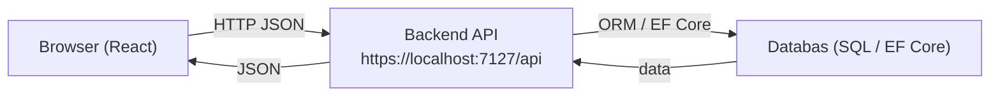
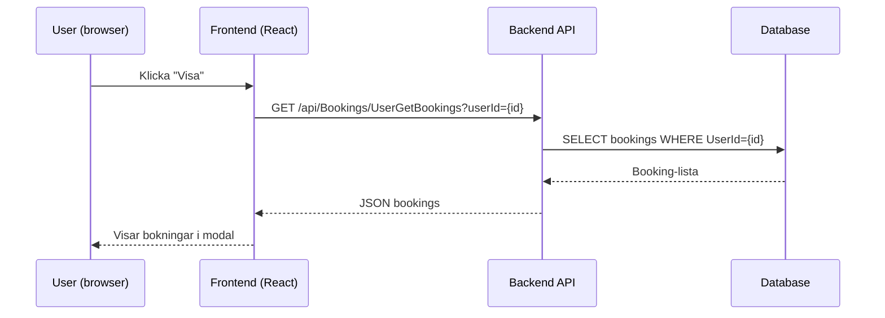

# ActiviGo — Frontend

Kortfattat

- Frontend byggd med Vite + React.
- Huvudmapp: `src/`. Viktiga sidor finns i `src/pages/`.
- Kommunicerar med backend via `src/services/api.js`. Default base-url: `https://localhost:7127/api`.

Snabbstart (utveckling)

1. Öppna terminal i mappen Frontend
2. Installera beroenden:
   npm install
3. Starta dev-server:
   npm run dev
4. Öppna browser: vanligtvis http://localhost:5173

Bygg för produktion

- npm run build
- Utdata läggs i `dist/` (se vite.config.js för inställningar)

Miljökonfiguration

- API-base url ställs i `src/services/api.js` (konstant `API_BASE_URL`).
- Om ni använder token-auth, lägg till hantering i `apiRequest` (headers).

Projektstruktur (kort)

- src/
  - pages/ — vyer (ActivitiesPage, AdminUsersPage, ...)
  - components/ — återanvändbara komponenter (ActivityCard, Modal, ...)
  - services/ — API wrapper (`api.js`)
  - styles/ — css filer
  - utils/ — hjälpfunktioner

Vanliga kommandon

- npm install
- npm run dev
- npm run build
- npm run preview

API-flöde (översikt)

Sekvens: öppna användardetaljer (Visa)

Tips för utveckling

- Använd devtools för att inspektera `src/services/api.js` anrop och responses.
- Admin-sidor (AdminUsersPage.jsx) antar backend-endpoints under `/api/Admin/*`.
- Om CORS-problem uppstår: konfigurera backend att tillåta `http://localhost:5173`.

Felsökning

- 404 från `/api/Admin/users/{id}` → kontrollera vilken endpoint frontend anropar (Admin/users versus Admin/users/{id}).
- Fel vid JSON-parse → apiRequest försöker parse text till JSON; kontrollera backend-response.

Styleguide & komponenter

- Modal-stilar i `src/styles/ActivityModal.css` / `ActivitiesPage.css`.
- Återanvänd `Modal.jsx` för enhetlighet.

Bidra

- Skapa en branch per feature/fix.
- Följ kodstil i projektet (prettier/eslint är konfigurerade enligt repo).

Licens & kontakt

- Läs repo-root README för licens och kontaktinformation.
