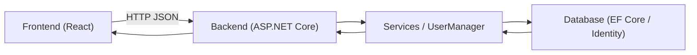
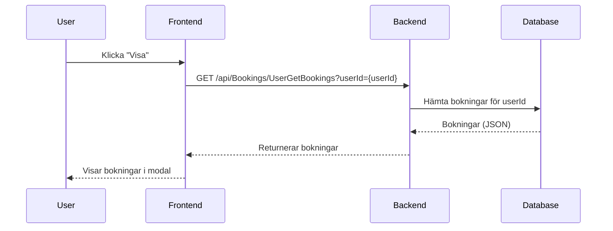

# ActiviGo — Projektöversikt (Frontend + Backend)

Kort summary

- Frontend: Vite + React (mappen `Frontend/`)
- Backend: .NET Web API (lösningen under `Backend/`, körs normalt på `https://localhost:7127`)
- Denna README ger snabbstart, arkitekturöversikt och länkar till komponent-README för utveckling.

Snabbstart (lokalt)

1. Starta backend

   - Öppna terminal i `Backend/ActiviGo.WebApi` (eller repo-rot)
   - Kör:
     dotnet build
     dotnet run --project ActiviGo.WebApi/ActiviGo.WebApi.csproj
   - API brukar vara tillgängligt på `https://localhost:7127`

2. Starta frontend

   - Öppna terminal i `Frontend/`
   - Kör:
     npm install
     npm run dev
   - Frontend brukar vara på `http://localhost:5173` (Vite)

3. Testa
   - Öppna webbläsaren mot frontend och använd devtools för nätverksanrop mot backend.

Struktur (högnivå)

- Frontend/
  - src/pages — vyer (ex. `AdminUsersPage.jsx`, `ActivitiesPage.jsx`)
  - src/services/api.js — API-wrapper (API_BASE_URL default: `https://localhost:7127/api`)
  - src/styles — CSS
- Backend/
  - ActiviGo.WebApi — controllers och startup
  - ActiviGo.Application — DTOs, services, mapping
  - ActiviGo.Infrastructure — data, migrations, repositories
  - ActiviGo.Domain — modeller, interfaces

Arkitektur (översikt)

Sekvens: Visa användarens bokningar

Konfiguration

- Frontend: `Frontend/src/services/api.js` — ändra `API_BASE_URL` vid behov.
- Backend: `Backend/ActiviGo.WebApi/appsettings.json` för connection strings mm.

Vanliga kommandon

- Frontend:
  - npm install
  - npm run dev
  - npm run build
- Backend:
  - dotnet build
  - dotnet run --project ActiviGo.WebApi/ActiviGo.WebApi.csproj
  - dotnet ef database update --project ActiviGo.Infrastructure --startup-project ActiviGo.WebApi

Tips & felsökning

- CORS-problem: lägg till frontend-origin i backend CORS-policy (Program.cs).
- 404 på endpoint: kontrollera route-attribut i Controllers (ex. `/api/Admin/users`).
- JSON-parse error: backend kan returnera text — api-wrapper i frontend försöker tolka text och returnera som payload.
- Använd browser devtools -> Network för att inspektera requests/responses.

Developer README-länkar

- Frontend detaljer: `Frontend/README.md`
- Backend detaljer: `Backend/README.md`

Contributing

- Skapa branch per feature/fix.
- Kör tester och lint enligt repo-setup innan PR.

Kontakt

- Se projektägare/maintainer i repo-root (eller huvud-README i organisationsrepo).

Licens

- Se root-repo eller organisationens licenspolicy.
