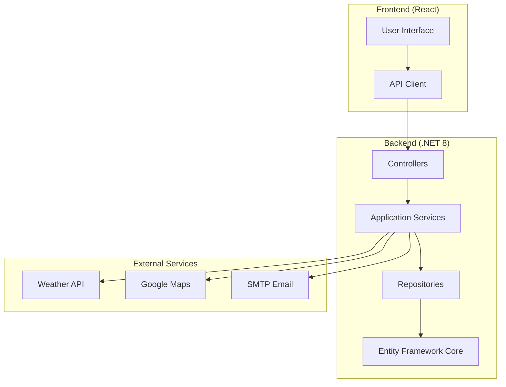

# ActiviGo-Luigi

Ett komplett aktivitetsbokningssystem för att hantera och boka olika aktiviteter med väderintegration och administrativ hantering.

## 📋 Innehåll

- [Översikt](#översikt)
- [Arkitektur](#arkitektur)
- [Teknisk stack](#teknisk-stack)
- [Kom igång](#kom-igång)
- [API-dokumentation](#api-dokumentation)
- [Autentisering](#autentisering)
- [Databas](#databas)
- [Frontend](#frontend)
- [Backend](#backend)
- [Deployment](#deployment)
- [Utveckling](#utveckling)

## 🎯 Översikt

ActiviGo-Luigi är ett modern aktivitetsbokningssystem som låter användare:
- Bläddra och boka aktiviteter
- Se väderprognoser för aktiviteter
- Administrera aktiviteter och användare (admin)
- Hantera bokningar och scheman
- Integrera med externa tjänster (väder, kartor)

## 🏗️ Arkitektur

Projektet följer Clean Architecture-principer med tydlig separation mellan lager:

```
ActiviGo-Luigi/
├── Backend/                    # .NET 8 Web API
│   ├── ActiviGo.WebApi/        # Presentation Layer (Controllers, Auth)
│   ├── ActiviGo.Application/   # Application Layer (Services, DTOs, Mapping)
│   ├── ActiviGo.Domain/        # Domain Layer (Models, Interfaces)
│   └── ActiviGo.Infrastructure/# Infrastructure Layer (Data Access, Repositories)
└── Frontend/                   # React + Vite
    ├── src/
    │   ├── pages/              # Sidor och vyer
    │   ├── components/        # Återanvändbara komponenter
    │   ├── services/          # API-kommunikation
    │   └── styles/            # CSS-stilar
    └── dist/                  # Byggda filer
```

### Arkitekturdiagram



## 🛠️ Teknisk stack

### Backend
- **.NET 8** - Huvudramverk
- **ASP.NET Core Web API** - REST API
- **Entity Framework Core** - ORM och databasåtkomst
- **ASP.NET Identity** - Användarhantering och autentisering
- **JWT Bearer Authentication** - Token-baserad autentisering
- **AutoMapper** - Objektmappning
- **FluentValidation** - Validering
- **Swagger/OpenAPI** - API-dokumentation

### Frontend
- **React 18** - UI-bibliotek
- **Vite** - Build tool och dev server
- **CSS3** - Styling
- **Fetch API** - HTTP-kommunikation

### Databas
- **SQL Server** - Huvuddatabas
- **Entity Framework Migrations** - Databasschema

### Externa tjänster
- **SMHI API** - Väderdata
- **Google Maps API** - Geocoding och kartor
- **SMTP** - E-postfunktionalitet

## 🚀 Kom igång

### Förutsättningar
- .NET 8 SDK
- Node.js 18+
- SQL Server (LocalDB fungerar)
- Visual Studio 2022 eller VS Code

### 1. Klona projektet
```bash
git clone <repository-url>
cd ActiviGo-Luigi
```

### 2. Backend setup
```bash
cd Backend/ActiviGo.WebApi

# Uppdatera connection string i appsettings.json
# Kör migrationer
dotnet ef database update --project ../ActiviGo.Infrastructure --startup-project .

# Starta backend
dotnet run
```

Backend körs på: `https://localhost:7127`
Swagger UI: `https://localhost:7127/swagger`

### 3. Frontend setup
```bash
cd Frontend

# Installera beroenden
npm install

# Starta dev server
npm run dev
```

Frontend körs på: `http://localhost:5173`

### 4. Konfiguration

#### Backend (appsettings.json)
```json
{
  "ConnectionStrings": {
    "DefaultConnection": "Server=localhost;Database=ActiviGoDb;Trusted_Connection=True;TrustServerCertificate=True;MultipleActiveResultSets=true"
  },
  "Jwt": {
    "Issuer": "ActiviGoAPI",
    "Audience": "ActiviGoAPIClient",
    "Key": "YourSuperLongSecretKey64CharactersMinimum!",
    "AccessTokenExpireMinutes": "15",
    "RefreshTokenExpireDays": "7"
  },
  "EmailSettings": {
    "SmtpHost": "smtp.gmail.com",
    "SmtpPort": 587,
    "SmtpUser": "your-email@gmail.com",
    "SmtpPass": "your-app-password"
  },
  "GoogleMaps": {
    "ApiKey": "your-google-maps-api-key"
  },
  "OpenWeather": {
    "ApiKey": "your-openweather-api-key"
  }
}
```

## 📚 API-dokumentation

### Huvudendpoints

#### Autentisering
- `POST /api/Auth/login` - Logga in
- `POST /api/Auth/register-user` - Registrera användare
- `POST /api/Auth/refresh` - Uppdatera token

#### Aktiviteter
- `GET /api/Activities` - Lista alla aktiviteter
- `POST /api/Activities` - Skapa aktivitet (Admin)
- `PUT /api/Activities/{id}` - Uppdatera aktivitet (Admin)
- `DELETE /api/Activities/{id}` - Ta bort aktivitet (Admin)

#### Aktivitetstillfällen
- `GET /api/ActivityOccurrence` - Lista alla tillfällen
- `POST /api/ActivityOccurrence` - Skapa tillfälle
- `PUT /api/ActivityOccurrence/{id}` - Uppdatera tillfälle
- `DELETE /api/ActivityOccurrence/{id}` - Ta bort tillfälle
- `GET /api/ActivityOccurrence/activity/{activityId}/available` - Tillgängliga tillfällen för aktivitet

#### Bokningar
- `POST /api/Bookings` - Skapa bokning
- `GET /api/Bookings/UserGetBookings` - Användarens bokningar
- `GET /api/Bookings/AdminGetBookings` - Alla bokningar (Admin)
- `DELETE /api/Bookings/{id}` - Avboka

#### Admin
- `GET /api/Admin/users` - Lista användare
- `PUT /api/Admin/users/{userId}` - Uppdatera användare
- `DELETE /api/Admin/users/{userId}` - Ta bort användare
- `POST /api/Admin/users/{userId}/roles/{roleName}` - Lägg till roll

#### Kategorier
- `GET /api/Category` - Lista kategorier
- `GET /api/Category/withActivities` - Kategorier med aktiviteter
- `POST /api/Category` - Skapa kategori
- `PUT /api/Category/{id}` - Uppdatera kategori
- `DELETE /api/Category/{id}` - Ta bort kategori

#### Zoner
- `GET /api/Zone` - Lista zoner
- `GET /api/Zone/withRelations` - Zoner med relationer
- `POST /api/Zone` - Skapa zon
- `PUT /api/Zone/{id}` - Uppdatera zon
- `DELETE /api/Zone/{id}` - Ta bort zon

#### Väder
- `POST /api/Weather/forecast` - Hämta väderprognos

### DTO-struktur

#### ActivityOccurrenceResponseDto
```json
{
  "id": 1,
  "startTime": "2024-01-15T10:00:00Z",
  "endTime": "2024-01-15T11:00:00Z",
  "durationMinutes": 60,
  "maxCapacity": 20,
  "participantsCount": 5,
  "availableSlots": 15,
  "activityId": 1,
  "activityName": "Yoga",
  "zoneId": 1,
  "zoneName": "Studio A",
  "latitude": 59.3293,
  "longitude": 18.0686,
  "isOutdoor": false,
  "isCancelled": false,
  "isActive": true
}
```

## 🔐 Autentisering

Systemet använder JWT Bearer Authentication med access- och refresh tokens:

### Token-struktur
- **Access Token**: 15 minuters giltighet
- **Refresh Token**: 7 dagars giltighet
- **Automatisk refresh**: Vid 401-svar

### Roller
- **Admin**: Fullständig åtkomst till alla funktioner
- **Member**: Kan boka aktiviteter och se sina bokningar
- **Staff**: Kan hantera aktiviteter och bokningar

### Exempel på autentisering
```javascript
// Login
const response = await fetch('/api/Auth/login', {
  method: 'POST',
  headers: { 'Content-Type': 'application/json' },
  body: JSON.stringify({ email: 'user@example.com', password: 'password' })
});

const { accessToken, refreshToken } = await response.json();

// Använda token i requests
const apiResponse = await fetch('/api/Activities', {
  headers: { 'Authorization': `Bearer ${accessToken}` }
});
```

## 🗄️ Databas

### Huvudentiteter
- **User** - Användare (ASP.NET Identity)
- **Activity** - Aktiviteter
- **ActivityOccurrence** - Aktivitetstillfällen
- **Booking** - Bokningar
- **Category** - Kategorier
- **Zone** - Zoner/platser
- **Location** - Platser
- **RefreshToken** - Refresh tokens

### Migrations
```bash
# Skapa ny migration
dotnet ef migrations add MigrationName --project ActiviGo.Infrastructure --startup-project ActiviGo.WebApi

# Uppdatera databas
dotnet ef database update --project ActiviGo.Infrastructure --startup-project ActiviGo.WebApi
```

## 🎨 Frontend

### Projektstruktur
```
Frontend/src/
├── pages/                 # Sidor
│   ├── ActivitiesPage.jsx
│   ├── AdminSchedulePage.jsx
│   ├── LoginPage.jsx
│   └── ...
├── components/           # Komponenter
│   ├── ActivityCard.jsx
│   ├── Modal.jsx
│   └── ...
├── services/            # API-kommunikation
│   └── api.js
├── styles/             # CSS-filer
└── utils/              # Hjälpfunktioner
```

### Viktiga komponenter
- **ActivityCard** - Visar aktivitetsinformation
- **Modal** - Återanvändbar modal-komponent
- **BookingCard** - Visar bokningsinformation
- **Sidebar** - Navigationsmeny

### API-kommunikation
Alla API-anrop hanteras genom `src/services/api.js` med automatisk token-hantering och felhantering.

## ⚙️ Backend

### Projektstruktur
```
Backend/
├── ActiviGo.WebApi/           # API Layer
│   ├── Controllers/          # API Controllers
│   ├── Auth/                 # JWT Authentication
│   └── Program.cs            # Startup configuration
├── ActiviGo.Application/     # Application Layer
│   ├── Services/             # Business Logic
│   ├── DTOs/                 # Data Transfer Objects
│   ├── Mapping/              # AutoMapper Profiles
│   └── Validation/           # FluentValidation
├── ActiviGo.Domain/          # Domain Layer
│   ├── Models/               # Domain Entities
│   ├── Interfaces/           # Repository Interfaces
│   └── Enum/                 # Enumerations
└── ActiviGo.Infrastructure/  # Infrastructure Layer
    ├── Data/                 # DbContext
    ├── Repositories/         # Repository Implementations
    └── Migrations/           # Database Migrations
```

### Viktiga services
- **ActivityService** - Aktivitetshantering
- **BookingService** - Bokningshantering
- **WeatherService** - Väderintegration
- **EmailService** - E-postfunktionalitet
- **GeocodingService** - Adresskonvertering

## 🚀 Deployment

### Backend deployment
```bash
# Bygg för produktion
dotnet publish ActiviGo.WebApi -c Release -o ./publish

# Kör i produktion
dotnet ./publish/ActiviGo.WebApi.dll
```

### Frontend deployment
```bash
# Bygg för produktion
npm run build

# Serve statiska filer (nginx/apache)
# Kopiera dist/ till web server root
```

### Docker (exempel)
```dockerfile
# Backend Dockerfile
FROM mcr.microsoft.com/dotnet/aspnet:8.0
COPY ./publish /app
WORKDIR /app
EXPOSE 80
ENTRYPOINT ["dotnet", "ActiviGo.WebApi.dll"]
```

## 🛠️ Utveckling

### Utvecklingsmiljö
1. Starta SQL Server
2. Kör backend: `dotnet run` (i ActiviGo.WebApi)
3. Kör frontend: `npm run dev` (i Frontend)
4. Öppna `http://localhost:5173`

### Debugging
- **Backend**: Använd Visual Studio debugger eller `dotnet run --verbosity normal`
- **Frontend**: Använd browser dev tools och React dev tools
- **API**: Använd Swagger UI på `https://localhost:7127/swagger`

### Testing
```bash
# Backend tests (om implementerade)
dotnet test

# Frontend tests (om implementerade)
npm test
```

### Kodstandarder
- **Backend**: C# naming conventions, async/await patterns
- **Frontend**: ESLint + Prettier konfiguration
- **Git**: Conventional commits

### Vanliga kommandon

#### Backend
```bash
dotnet build                    # Bygg projekt
dotnet run                      # Kör projekt
dotnet ef migrations add Name   # Skapa migration
dotnet ef database update       # Uppdatera databas
dotnet clean                    # Rensa build artifacts
```

#### Frontend
```bash
npm install                    # Installera beroenden
npm run dev                    # Starta dev server
npm run build                  # Bygg för produktion
npm run preview                # Förhandsvisa build
npm run lint                   # Kör ESLint
```

## 📝 Licens

Detta projekt är licensierad under [MIT License](LICENSE).

## 🤝 Bidrag

1. Forka projektet
2. Skapa en feature branch (`git checkout -b feature/AmazingFeature`)
3. Commita ändringar (`git commit -m 'Add some AmazingFeature'`)
4. Pusha till branchen (`git push origin feature/AmazingFeature`)
5. Öppna en Pull Request

## 📞 Support

För support och frågor:
- Skapa en issue i GitHub
- Kontakta projektägaren

---

**ActiviGo-Luigi** - Modern aktivitetsbokning med väderintegration 🎯
